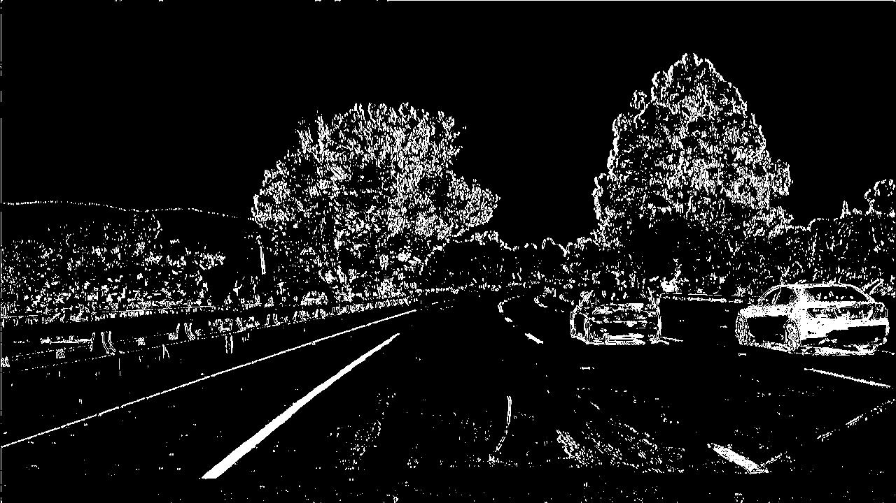
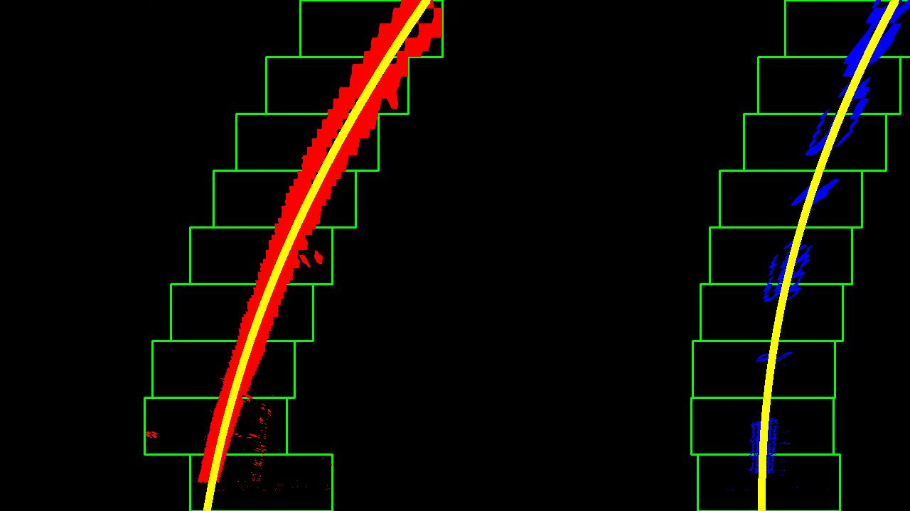
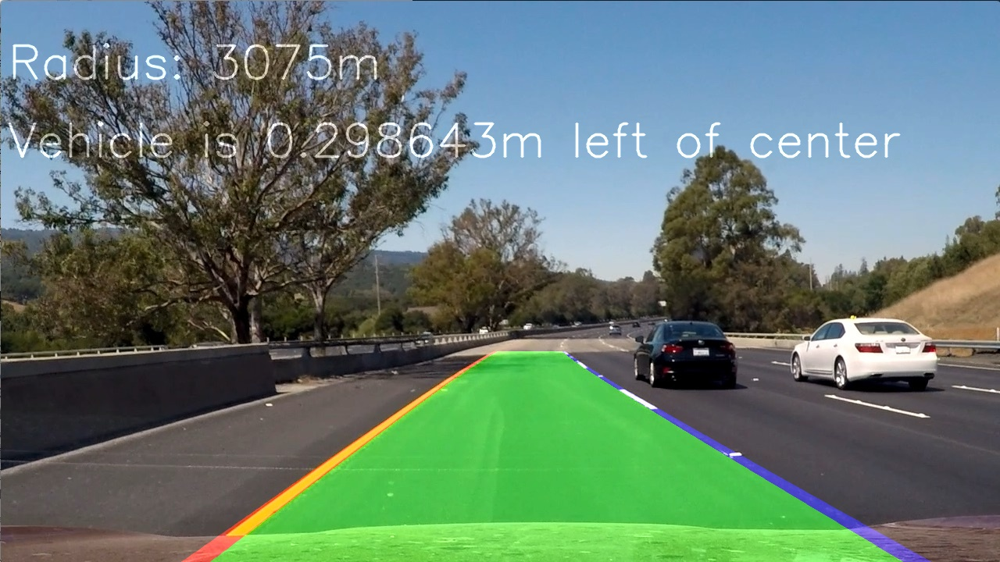

## Advanced Lane Finding

In this project, your goal is to write a software pipeline to identify the lane boundaries in a video.

The Project
---

The goals / steps of this project are the following:

* Compute the camera calibration matrix and distortion coefficients given a set of chessboard images.
* Apply a distortion correction to raw images.
* Use color transforms, gradients, etc., to create a thresholded binary image.
* Apply a perspective transform to rectify binary image ("birds-eye view").
* Detect lane pixels and fit to find the lane boundary.
* Determine the curvature of the lane and vehicle position with respect to center.
* Warp the detected lane boundaries back onto the original image.
* Output visual display of the lane boundaries and numerical estimation of lane curvature and vehicle position.

Camera Calibration
---
* Compute the camera calibration matrix and distortion coefficients given a set of chessboard images.

The code for this step is in calibration.py

The images for camera calibration are stored in the folder called `camera_cal`. 

I start by initializing an object points array (x,y,z) and an image points array (x,y). Object points are the real world 3D points of the object and image points are the corresponding 2D points of the object, in the image plane. In this case, the object is a chessboard, so Z=0 for all object points. 

We then loop through each calibration image. For each image, we convert it to grayscale, then find the chessboard corners. We then append the corresponding image points and object points to their respective arrays. 

When image and object points have been collected for each image, we pass them to the calibration function to determine our calibration matrix. 

To test our calibration, I applied the calibration matrix to a calibration image. The calibration matrix correctly undistorts the image as shown below.

Pipeline
---

* Apply distortion correction
The first step in the pipeline is to apply distortion correction to each image. The matrix for this operation is calculated in the calibration step. Below is an example of a distorted image (before the undistort operation is applied)

And below is an exmaple of an undistorted image (after the undistort operation is applied). 

* Use color transforms, gradients, etc., to create a thresholded binary image.
Next we use do thresholding. This is handled by the doThresholding() function in main.py. 
First we convert to HLS color space and separate the S channel. We then threshold the S channel. 
Separately, we convert the same image to grayscale and apply the Sobel operator in the X direction to accentuate lines away from horizontal. We threshold this image as well.
Then we combine the two binary thresholds. The output is as shown below:

* Apply a perspective transform to rectify binary image ("birds-eye view").
The next step of our pipline is applying a perspective transform to our image. This gives us a birds-eye view of the road in front of us. We do this to make it easier to fit a polynomial to the lane lines. The perspective transform takes place in the warp() function in main.py. An visual example of the perspective transform is shown below:

* Detect lane pixels and fit to find the lane boundary.
Next, we detect the lane pixels and fit a polynomial to each lane line. This is done in the fit_polynomial() function in main.py. First, we slide a window over the bottom row of pixels. Then we find the center of the lane lines by looking for the peak of a histogram. After the peak for the left and right lane line is found, we move our window up a row and repeat. We then fit a polynomial to the left and right rows respecitvely. The result is shown below:

* Determine the curvature of the lane and vehicle position with respect to center.
Once we have a polynomial fit to the lane lines, we can determine the curvature of the road and the vehicle position with respect to center. 
The vehcle position is calculated by determining the horizontal location of the lane lines relative to the center of the image. 
The curvature is calculated by averaging the radius of the right and left lane lines. 

* Warp the detected lane boundaries back onto the original image.
After the lane lines are detected, drawn on the image, and the vehicle position and lane curvature is calculated, we transform the perspective of the image back to "drivers view" with the unwarp() function.

* Output visual display of the lane boundaries and numerical estimation of lane curvature and vehicle position.

We then display the information visually as shown below:

