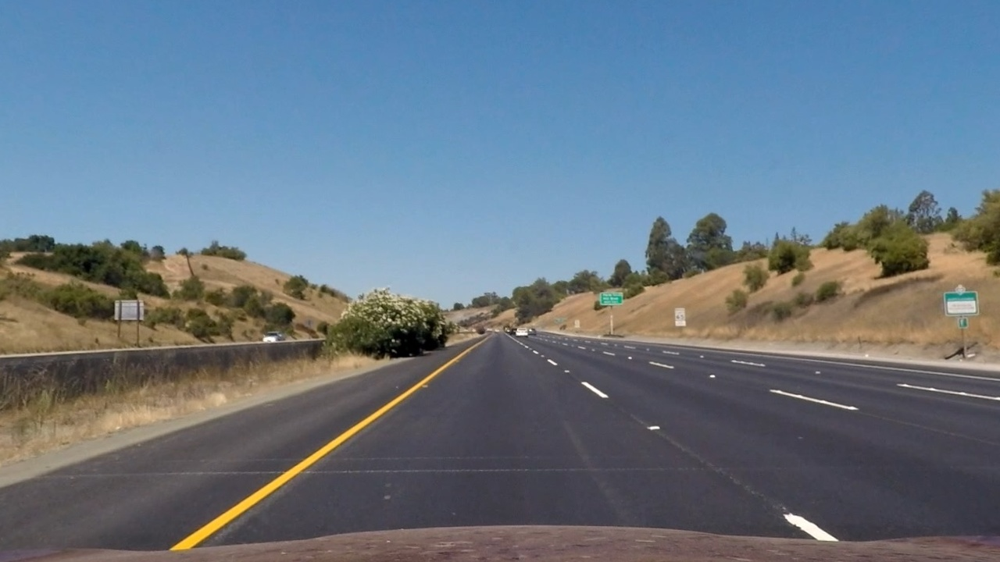

## Advanced Lane Finding

In this project, your goal is to write a software pipeline to identify the lane boundaries in a video.

The Project
---

The goals / steps of this project are the following:

* Compute the camera calibration matrix and distortion coefficients given a set of chessboard images.
* Apply a distortion correction to raw images.
* Use color transforms, gradients, etc., to create a thresholded binary image.
* Apply a perspective transform to rectify binary image ("birds-eye view").
* Detect lane pixels and fit to find the lane boundary.
* Determine the curvature of the lane and vehicle position with respect to center.
* Warp the detected lane boundaries back onto the original image.
* Output visual display of the lane boundaries and numerical estimation of lane curvature and vehicle position.

Camera Calibration
---
* Compute the camera calibration matrix and distortion coefficients given a set of chessboard images.

The code for this step is in calibration.py

The images for camera calibration are stored in the folder called `camera_cal`. 

I start by initializing an object points array (x,y,z) and an image points array (x,y). Object points are the real world 3D points of the object and image points are the corresponding 2D points of the object, in the image plane. In this case, the object is a chessboard, so Z=0 for all object points. 

We then loop through each calibration image. For each image, we convert it to grayscale, then find the chessboard corners. We then append the corresponding image points and object points to their respective arrays. 

When image and object points have been collected for each image, we pass them to the calibration function to determine our calibration matrix. 

To test our calibration, I applied the calibration matrix to a calibration image. The calibration matrix correctly undistorts the image as shown below.

Pipeline
---

* Apply distortion correction
 - Distorted Image - 

 - Undistorted Image - 

* Use color transforms, gradients, etc., to create a thresholded binary image.
* Apply a perspective transform to rectify binary image ("birds-eye view").
* Detect lane pixels and fit to find the lane boundary.
* Determine the curvature of the lane and vehicle position with respect to center.
* Warp the detected lane boundaries back onto the original image.
* Output visual display of the lane boundaries and numerical estimation of lane curvature and vehicle position.

The images in `test_images` are for testing your pipeline on single frames.  If you want to extract more test images from the videos, you can simply use an image writing method like `cv2.imwrite()`, i.e., you can read the video in frame by frame as usual, and for frames you want to save for later you can write to an image file.  

To help the reviewer examine your work, please save examples of the output from each stage of your pipeline in the folder called `output_images`, and include a description in your writeup for the project of what each image shows.    The video called `project_video.mp4` is the video your pipeline should work well on.  

The `challenge_video.mp4` video is an extra (and optional) challenge for you if you want to test your pipeline under somewhat trickier conditions.  The `harder_challenge.mp4` video is another optional challenge and is brutal!

If you're feeling ambitious (again, totally optional though), don't stop there!  We encourage you to go out and take video of your own, calibrate your camera and show us how you would implement this project from scratch!

## How to write a README
A well written README file can enhance your project and portfolio.  Develop your abilities to create professional README files by completing [this free course](https://www.udacity.com/course/writing-readmes--ud777).

